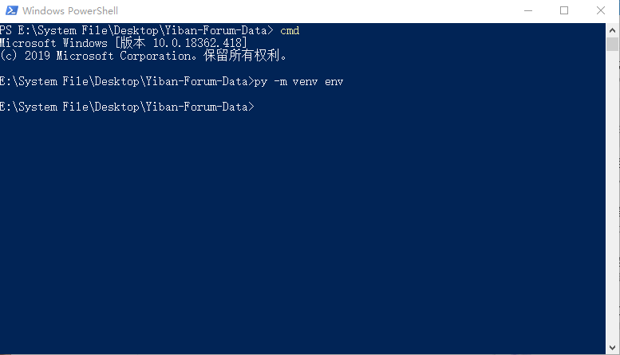

<!--
 * @Author: your name
 * @Date: 2020-04-25 09:19:10
 * @LastEditTime: 2020-06-06 09:11:14
 * @LastEditors: Please set LastEditors
 * @Description: In User Settings Edit
 * @FilePath: \Yiban\README.md
 -->
### 说明

1. 本程序仅供易班各高校统计微社区统计信息使用，所获数据应当避免外泄，及时删除。
1. 本程序在 Window 10 & Python 3.8 环境开发，未对其它环境测试。
1. 如遇异常，请确认非网络问题后，截图留言。



### 功能使用说明

- 安装依赖

```sh
pip install yiban
```

- 更新至最新版

```
pip install -i https://pypi.org/simple -U yiban
```

- 查看帮助

```sh
python -m yiban -h
```

- 使用 Forum-Data

```sh
python -m yiban forum
```
