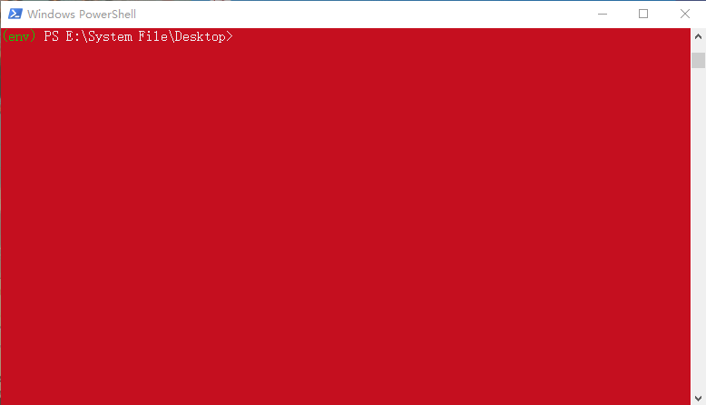

# 易班微社区统计

### 声明

1. 本程序仅供各高校易班统计微社区易班信息使用，所获数据应当及时删除,避免外泄。

### 前期准备

1. 本程序在 [Window 10](https://www.microsoft.com/zh-cn/software-download/windows10) & [Python 3.8](python) 环境开发，未对其它环境测试。
1. 以下操作全程用网，请确保网络连接正常，网络质量稳定。
1. 如遇异常，请确认非网络问题后，截图留言。



### 功能使用说明


请确认安装好 Python 3 后，请在 powershell 
> 在文件所在目录 按住 shift 键，并点击鼠标右键，选择 powershell 即可打开

- 安装依赖(仅首次执行）

```sh
pip install yiban
```

- 初始化程序

```sh
# 初始化 Forum-Data 文件夹
python -m yiban forum
# 切换至 Forum-Data 程序文件夹
cd Forum-Data
```

- 将配置好的 [config.py](config.py) 文件放入工作目录

- 查看帮助

```sh
python edata.py -h
```

- 统计话题评论（单篇）

```sh
python edata.py replys 易班话题链接
```

- 话题内容（单篇）

```sh
python edata.py content 易班话题链接
```

- 阅读指定话题(单篇)

```
python edata.py clicks 阅读次数 易班话题链接
```

- 阅读指定话题(多篇)

```sh
python edata.py clicks 阅读次数 存储话题链接的文本文档地址
```

- 查看微社区数据表头

```sh
python edata.py heads
```

- 获取微社区数据（请在查询数据之前执行）

```sh
python edata.py articles 开始年-月-日
```

提醒：执行 SQL 操作前，请确认已执行获取微社区数据的操作

- SQL 查询数据(Ctrl + C 退出)

```sh
python edata.py sql
```

- SQL 查询各归属方发帖数量

```sh
python edata.py count
```

- SQL 查询示例

```sh
python edata.py demo
```

- 清理当前目录下所有的要删除的文件类型
> 要删除的文件类型由 config.py 文件中的 del_file 指定

```sh
python edata.py clean
```

### FAQ

- powershell 如何打开？

答：使用资源管理器打开相应的目录 按住 shift 键，并在空白处点击鼠标右键，选择 `powershell` 或 `命令提示符` 即可打开。

- 发生以下错误,我该如何处理？

> 无法将“python”项识别为 cmdlet、函数、脚本文件或可运行程序的名称。

> 'python' 不是内部或外部命令，也不是可运行的程序或批处理文件。

答：请重新安装，切记勾选 path 选项

- 如何此程序后台运行？

答：不建议后台运行，如果需要使用 pythonw 替换 python 执行以上操作。

- 必须使用 python 3.8 以上版本吗？

答：程序采用的异步函数 `asyncio.run(coro, *, debug=False)` 是 3.7 版的新功能。低版本需要自己修改代码兼容。

- 我正在开发项目对新版本有兼容问题，怎么办？

答：保留旧版，安装新版，使用 `py -x.y` 或 `pyw -x.y` 指定版本运行，建议项目开发时搭建虚拟环境。

- 什么是 SQL ，我完全不会怎么办？

答：SQL，指结构化查询语言，全称是 Structured Query Language。是一种 ANSI（American National Standards Institute 美国国家标准化组织）标准的计算机语言。SQL 可以让您可以访问和处理数据库。具体可以参考 [菜鸟教程-SQL](https://www.runoob.com/sql/sql-tutorial.html)。
本程序封装了 SELECT 操作，故只能通过 SQL 查询数据。通过本程序的 `python edata.py demo` 命令模仿学习

- 我用的时 Linux ，程序无法运行？

答：当前仅在 Windows 环境开发测试，如果需要请自行转码适配，运行时请先确认版本。

- 我发现阅读话题的本质就是刷浏览量，这样真的好吗？

答：这样真的不好，第一是这样会增加易班服务器的压力，第二是对自己流量有很大的消耗，这个功能仅供大家学习研究 python 使用，切不可恶意刷浏览量，否则后果自负。

### 二次开发

- 压缩包（下载后一定要先解压）：[最新版压缩包](https://github.com/DukeBode/Yiban/archive/Forum-Data.zip)

- git 命令（需要有 git 环境）：

```sh
git clone -b Forum-Data https://gitee.com/OSLUT/Yiban.git
```

---

### 相关软件

- 7-zip | 解压本程序包 | [https://www.7-zip.org/](https://www.7-zip.org/) 
- VScode | 编辑程序代码 | [https://code.visualstudio.com/](https://code.visualstudio.com/) 
