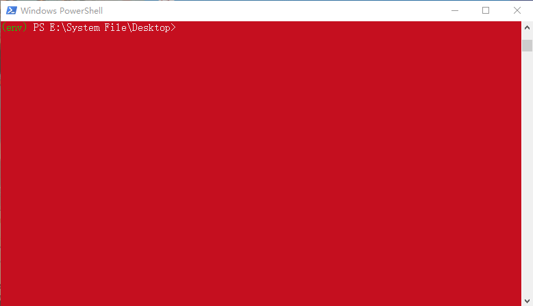

### 说明

1. 本程序仅供易班各高校统计微社区统计信息使用，所获数据应当避免外泄，及时删除。
1. 本程序在 Window 10 & Python 3.8 环境开发，未对其它环境测试。
1. 如遇异常，请确认非网络问题后，截图留言。



### 功能使用说明

提醒：使用之前请使用贵微社区定制的 config.py 覆盖系统自带的 config.py 文件

请确认安装好 Python 3 后，请在 powershell 
> 在文件所在目录 按住 shift 键，并点击鼠标右键，选择 powershell 即可打开

- 安装依赖

```sh
pip install yiban
```

- 查看帮助

```sh
python -m yiban -h
```

- 使用 Forum-Data [文档](Forum-Data)

```sh
python -m yiban forum
```

### FAQ

- 如何此程序后台运行？

答：不建议后台运行，如果需要使用 pythonw 替换 python 执行以上操作。

- 必须使用 python 3.8 以上版本吗？

答：程序采用的异步函数 `asyncio.run(coro, *, debug=False)` 是 3.7 版的新功能。低版本需要自己修改代码兼容。

- 我正在开发项目对新版本有兼容问题，怎么办？

答：保留旧版，安装新版，使用 `py -x.y` 或 `pyw -x.y` 指定版本运行，建议项目开发时搭建虚拟环境。

- 我用的时 Linux ，程序无法运行？

答：当前仅在 Windows 环境开发测试，如果需要请自行转码适配，运行时请先确认版本。

### 二次开发

- 压缩包（下载后一定要先解压）：[最新版压缩包](https://github.com/DukeBode/Yiban/archive/Forum-Data.zip)

- git 命令（需要有 git 环境）：

```sh
git clone -b Forum-Data https://gitee.com/OSLUT/Yiban.git
```
